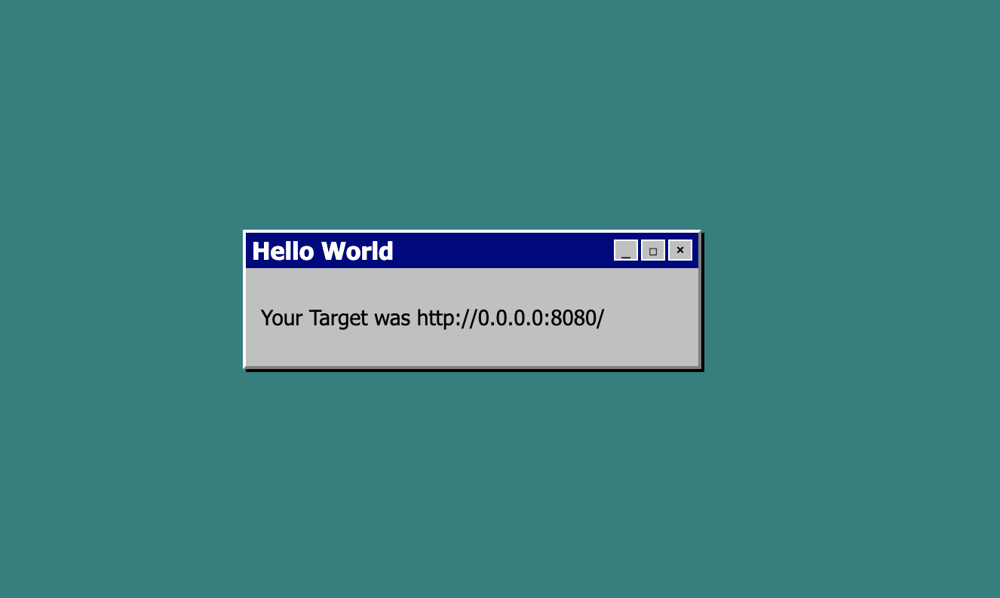

# FastAPI Sample App

Sample app serves the `index.html` and shows the REQUEST URL in a nice box. 



## Run the App

Install the requirements
```
pip install -r requirements.txt
```
then run the app 

```
fastapi run --port 8080 app.py
```
