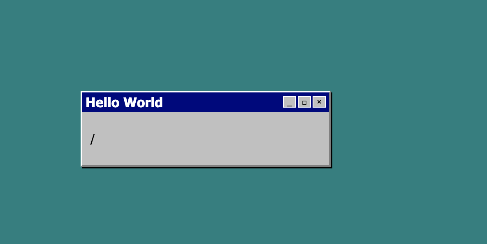

# NodeJS Sample App

Sample app serves the `index.html` and shows the REQUEST URL in a nice box. 



## Run the App

Install your node modules
```
npm install . 
```
then run the app 

```
node server.js
```

## Docker 

There is a also a docker container for this app. 

Build the container

```
docker build -t nodejs_sample_application . 
```

Then run the app 

```
docker run --rm -it -p 8080:8080 nodejs_sample_application
```
